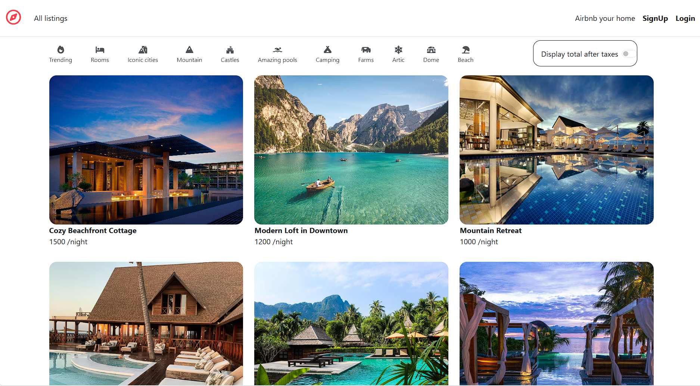

# Wanderlust 🌍

A full-stack Airbnb-like web application.

---

## Features
- User authentication and session management  
- Create, edit, and delete property listings  
- Image uploads using Cloudinary  
- Interactive maps with Mapbox integration  
- Responsive UI built with Bootstrap  

---

## Tech Stack
**Backend:** Node.js, Express.js  
**Frontend:** EJS, Bootstrap  
**Database:** MongoDB  
**APIs:** Mapbox, Cloudinary  
**Deployment:** Render  

---

## Screenshots

### Home Page

### Listing Page

### Create Listing

---

## Live Demo
🔗 https://wanderlust-wps4.onrender.com  

> **Note:** Initial load may show a temporary 404 due to server cold start on free-tier hosting.
